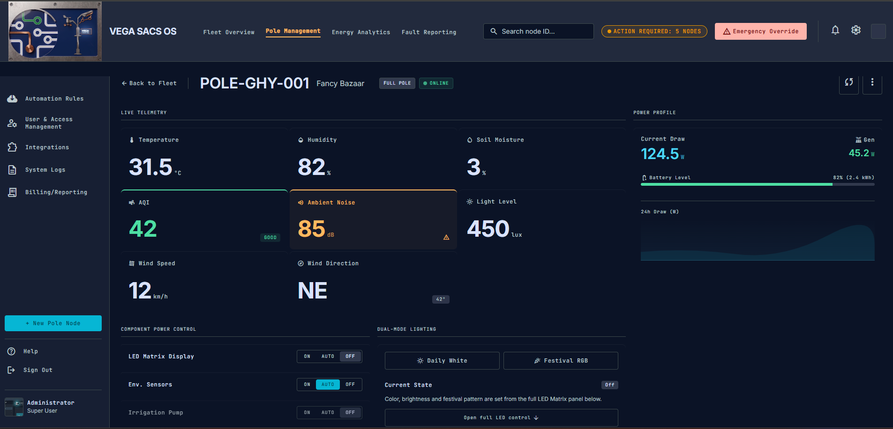
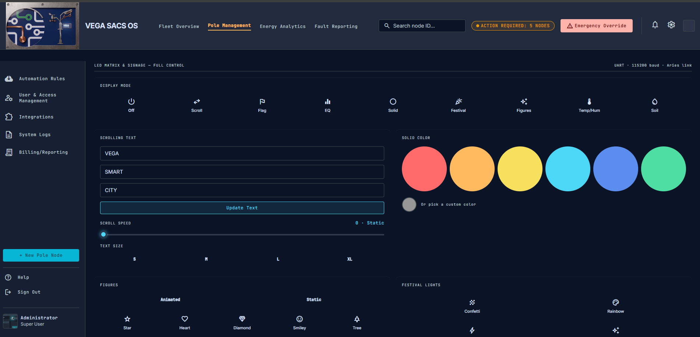
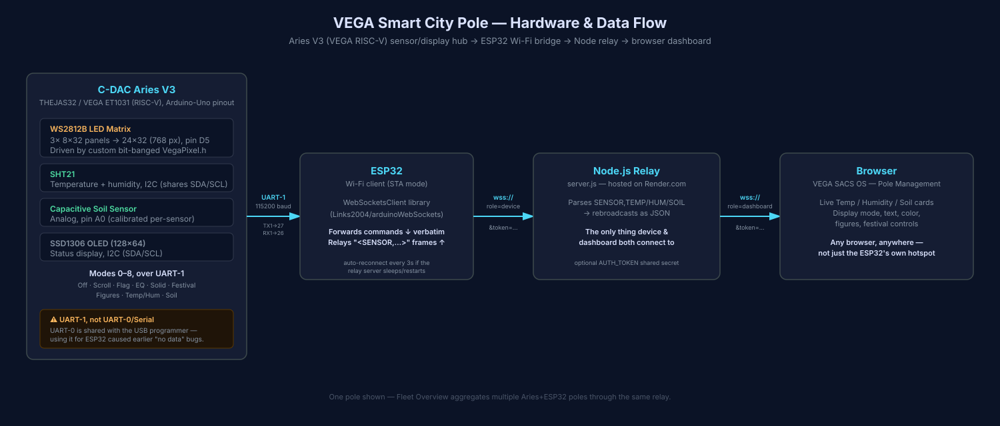

# VEGA SACS OS

A multi-page "Smart City Governance" console for a fleet of solar-powered
street poles — each running an LED matrix display, environmental sensors,
and (eventually) irrigation, lighting, and fault-monitoring hardware.

**Pole Management is the only page currently wired to real hardware.** The
other eight are forward-looking mockups — static UI, no live data — for
features you'll build out as more pole subsystems come online.

<p align="center">
  
</p>
<p align="center">
  
</p>

## Hardware

Each pole is two boards talking over a dedicated UART link, plus whatever
this repo hosts to bridge them to the internet:

<p align="center">
  
</p>

> No photo of the assembled pole is in this repo yet — the diagram above is
> generated from the actual firmware/wiring, not a stand-in for one. Drop a
> real photo in `assets/` and reference it here once you have one.

**C-DAC Aries V3** (THEJAS32 / VEGA ET1031 — an Indian RISC-V SoC, Arduino
Uno pinout) is the sensor and display hub:
- **LED matrix** — three WS2812B 8×32 panels wired side-by-side into a
  24×32 (768-pixel) matrix on pin `D5`, driven by a small custom driver
  (`VegaPixel.h`) rather than the usual Adafruit NeoPixel/FastLED
  libraries, because they don't target this RISC-V core. It's a bare
  bit-banged WS2812B sender: pin `HIGH`/`LOW` timed with `NOP` spin-loops
  tuned for a 100MHz core, with interrupts disabled for the duration of
  each `show()` call so the strict WS2812B timing isn't preempted.
- **SHT21** temperature/humidity sensor — I2C (shares the `SDA`/`SCL` bus
  with the OLED).
- **Capacitive soil moisture sensor** (analog) on `A0` — calibrated
  per-unit against dry-air and fully-submerged ADC readings.
- **SSD1306 128×64 I2C OLED** for local status (boot messages, current
  mode) — compiled out with a single `#define` if it doesn't build
  against a given core.

**ESP32** is the Wi-Fi bridge — it doesn't run its own hotspot/web server
(an earlier revision did); instead it joins your existing Wi-Fi as a
client and holds one outbound WebSocket connection to the relay server
described below, forwarding whatever passes each direction over UART.

**Wiring** between the two boards, on a UART separate from Serial/USB
(mixing them was the root cause of an earlier "no sensor data" bug, since
UART-0 on the Aries is permanently shared with its USB programming chip):

| Aries V3 | ESP32 |
|---|---|
| `TX1` | `GPIO27` (RX) |
| `RX1` | `GPIO26` (TX) |
| `GND` | `GND` (required) |

115200 baud. `TX1`/`RX1` are a separate labeled header from `D0`/`D1` —
check your board's silkscreen.

**Arduino libraries needed** for the Aries sketch: Adafruit GFX Library,
Adafruit SSD1306, an SHT21 I2C library (e.g. Rob Tillaart's SHT2x). For
the ESP32 sketch: WebSockets
(by Markus Sattler / Links2004).

**A known toolchain gotcha:** the VEGA RISC-V Arduino core (v1.1.2) defines
`map()` in two different translation units, so any sketch that calls
Arduino's built-in `map()` fails to link with a "multiple definition"
error. The current firmware avoids `map()` entirely (soil % is plain
arithmetic instead) — keep that in mind if you extend it.

## What actually works today

The **Pole Management** page drives a real ESP32 + C-DAC Aries V3 board over
a hosted WebSocket relay:

```
Browser  <--WebSocket-->  Node relay server (Render.com)  <--WebSocket-->  ESP32  <--UART-->  Aries V3 + LED matrix + sensors
```

- **Live Telemetry** — real-time temperature, humidity, and soil moisture,
  pushed the instant a new reading arrives (no polling).
- **Display Mode** — Off · Scroll · Flag · EQ · Solid · Festival · Figures ·
  Temp/Hum · Soil, all applied the moment you tap a mode.
- **Scrolling Text** — three custom words, adjustable scroll speed
  (static → fast), and text size (S/M/L/XL).
- **Solid Color** — preset swatches or a full custom color picker.
- **Figures** — Star, Heart, Diamond, Smiley, Tree, drawn procedurally on
  the matrix, in animated or static mode.
- **Festival Lights** — Confetti, Rainbow, Comet, Twinkle patterns.
- **Sensor History** — a rolling in-memory chart of the last ~120 readings.
- **Dual-Mode Lighting** and **Component Power Control** quick-toggles at
  the top of the page mirror/drive the same state as the full control panel
  below them.

The AQI, Ambient Noise, Light Level, Power Profile/Battery, Env. Sensors,
Irrigation Pump, and Fault Log widgets on this page are still static
placeholders — they'll come online the same way Pole Management did, once
that hardware exists.

## Pages

| Page | File | Status |
|---|---|---|
| Fleet Overview | `fleet-overview.html` | Mockup |
| **Pole Management** | `pole-management.html` | **Live — controls your ESP32/Aries hardware** |
| Energy Analytics | `energy-analytics.html` | Mockup |
| Fault Reporting | `fault-reporting.html` | Mockup |
| Automation Rules | `automation-rules.html` | Mockup |
| User & Access Management | `user-access-management.html` | Mockup |
| Integrations | `integrations.html` | Mockup |
| System Logs | `system-logs.html` | Mockup |
| Billing/Reporting | `billing-reporting.html` | Mockup |

`index.html` redirects straight to `pole-management.html`, preserving your
`?token=...` (and any other query params) along the way. Every nav link —
top bar and sidebar, on every page — carries the same query string forward
when you click between tabs, for the reason covered in
[Authentication](#authentication) below.

## How it's wired together

- The **Aries V3** board (see [Hardware](#hardware) above for the full
  pinout) drives the LED matrix, reads the temp/humidity and soil sensors,
  and talks to the ESP32 over UART-1 — `0`–`8` mode select, `SPEED:`,
  `COLOR:`, `FIGURE:`, `FIGUREMODE:`, `FESTIVAL:`, `TEXTSIZE:`, and
  free-text words for the scrolling display.
- The **ESP32** joins your Wi-Fi as a client (not its own access point) and
  opens a WebSocket connection out to the relay server.
- The **Node relay server** (`server.js`, hosted free on Render.com) is the
  only thing both the ESP32 and any browser connect to. It:
  - accepts two kinds of WebSocket client on `/ws`, told apart by
    `?role=device` (the ESP32) or `?role=dashboard` (a browser),
  - parses the Aries sensor frame (`SENSOR,TEMP:24.0,HUM:55,SOIL:42`) and
    rebroadcasts it as JSON (`{"type":"sensor","temp":"24.0",...}`) to every
    connected dashboard,
  - forwards any `{"cmd":"..."}` a dashboard sends straight to every
    connected device, verbatim.
- Your **ESP32 firmware needs no changes** to work with this dashboard —
  it's protocol-agnostic and just forwards whatever command string it
  receives. It needs to be pointed at the right server, though (see below).

## Authentication

`server.js` supports an optional shared-secret token via the `AUTH_TOKEN`
environment variable. If it's set, both the ESP32 (`role=device`) and every
browser dashboard (`role=dashboard`) must include a matching
`&token=YOUR_TOKEN` on their WebSocket URL, or the server closes the
connection immediately (WebSocket close code `4001`).

This is why every in-app nav link preserves the query string: the moment a
page loads without `?token=...` in its URL, its dashboard socket gets
rejected as unauthorized and the connection status pill sits on
"Reconnecting" (or, since the fix, explicitly says "Unauthorized") forever
— even though nothing else is wrong. Always enter the app via
`https://your-app.onrender.com/?token=YOUR_TOKEN`, and clicking around from
there keeps it attached.

## Deploy to Render

1. Push this folder to a GitHub repo (keep it separate from any older
   dashboard project — each Render service gets its own URL).
2. Render → **New → Web Service** → connect the repo.
3. Settings:
   - **Runtime**: Node
   - **Build Command**: `npm install`
   - **Start Command**: `npm start`
4. Environment variable (optional but recommended):
   - `AUTH_TOKEN` = a secret string of your choice
5. Deploy. Once live, open:
   ```
   https://your-app.onrender.com/?token=YOUR_TOKEN
   ```
   It'll redirect straight into Pole Management.

> **Free tier note:** free Render services sleep when idle and take a few
> seconds to wake. The ESP32 sketch retries every 3s
> (`setReconnectInterval(3000)`), so it reconnects on its own.

## Point your ESP32 at this server

In `ESP32_SmartCity_WSClient.ino`, set:

```cpp
const char* SERVER_HOST = "your-app.onrender.com";   // no https://, no trailing slash
const char* SERVER_PATH = "/ws?role=device&token=YOUR_TOKEN"; // omit &token=... if you didn't set AUTH_TOKEN
```

Re-upload, then watch the Serial Monitor (115200 baud) for:

```
Wi-Fi connected, IP: ...
WebSocket connected to server
```

If you switch this dashboard to a *different* Render service later, the
ESP32 has to be re-flashed to point at the new hostname — it will otherwise
keep talking to whichever server it was last told about, silently, with no
error on either end. That mismatch is the single most common cause of "the
dashboard loads fine but shows no sensor data and nothing I click does
anything."

## Local testing

```bash
npm install
npm start
# visit http://localhost:3000
```

Simulate the ESP32 without hardware by connecting a WebSocket client to
`ws://localhost:3000/ws?role=device` and sending
`SENSOR,TEMP:24.0,HUM:55,SOIL:42`.

## Troubleshooting

| Symptom | Likely cause | Fix |
|---|---|---|
| Status pill stuck on "Reconnecting" | Missing/wrong `?token=` in the URL, or `AUTH_TOKEN` mismatch | Reload via `/?token=YOUR_TOKEN`; confirm it matches Render's `AUTH_TOKEN` and the ESP32 sketch's `SERVER_PATH` |
| Pill says "Unauthorized" | Same as above — the server rejected the socket outright | Same fix |
| Pill is ONLINE, but sensors stay "--" and controls do nothing | ESP32 is connected to a *different* server than this browser | Re-check `SERVER_HOST` in the ESP32 sketch and re-flash; confirm `[device] connected` shows up in *this* Render service's logs |
| Render logs show `total devices` climbing (2, 3, 4...) without matching disconnects | Something is causing the device connection to drop and reconnect repeatedly | Check Wi-Fi signal/power stability to the ESP32; if you've added any server-side keepalive/heartbeat logic, confirm the ESP32 library actually answers it — an unanswered ping will make the server kill a perfectly fine connection |
| A specific control (e.g. a slider) is invisible or unstyled | A custom CSS rule depends on Tailwind's `theme()` function inside a `::-webkit-*` pseudo-element, which the CDN build doesn't always resolve there | Replace `theme('colors.x')` with the literal hex value in that rule |

## As you add real functionality to other pages

Each mockup page currently has no `<script>` wiring to the server — they're
static HTML/Tailwind. When you're ready to bring one online (e.g. Fault
Reporting, once you have real fault data), the pattern to copy is the
`<script>` block at the bottom of `pole-management.html`: open a WebSocket
to `/ws?role=dashboard`, listen for `message` events, and call `sendCmd()`
to push commands back through the same relay.
